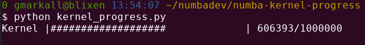

# Kernel-driven progress bar in Numba




## What is it?

It's a progress bar whose completion is controlled from a running CUDA kernel
compiled with [https://numba.pydata.org](Numba).


## How do I run it?

```
python kernel_progress.py
```


## What do I need to run it?

* The latest Numba master branch
* A Compute Capability 6.0 or greater CUDA GPU (e.g. GTX 1xxx, RTX 2/3xxx,
  Pascal / Volta / Turing / Ampere Quadro GPUs).
* Linux ([Managed
  Memory](https://numba.readthedocs.io/en/latest/cuda-reference/memory.html#numba.cuda.managed_array)
  in Numba is experimental on Windows, and this use of it seems to crash it).
* ... Maybe other things I forgot to mention.


## How does it work?

A managed array visible to both the host and device holds an integer
representing current progress:

```python
progress = cuda.managed_array(1, dtype=np.uint64)
```

The running kernel increments this in a loop (with some sleeping, so it doesn't
run too fast):

```python
for i in range(MAX_VAL):
    cuda.atomic.inc(progress, 0, MAX_VAL)
    cuda.nanosleep(KERNEL_SLEEP)
```

Simultaneously, the host reads the progress value and updates the progress bar
in a loop:

```python
while val < MAX_VAL:
    sleep(0.001)
    val = progress[0]
    bar.goto(val)
```


## Will this work?

Maybe...

* I have not thought hard about synchronization issues between the host and
  device,
* I have not tested this extensively,
* YMMV!


## Should I use this in my program?

Maybe not...

* If you're going to, you should probably read and understand [Section M.2.2 of
  the CUDA Programming
  Guide](https://docs.nvidia.com/cuda/cuda-c-programming-guide/index.html#um-coherency-hd),
  which discusses coherency and concurrency of managed memory.
* You should also examine whether this technique has a performance impact,
* and think about whether breaking a long-running kernel launch into multiple
  shorter kernels would provide a better way of synchronizing progress with the
  host.
